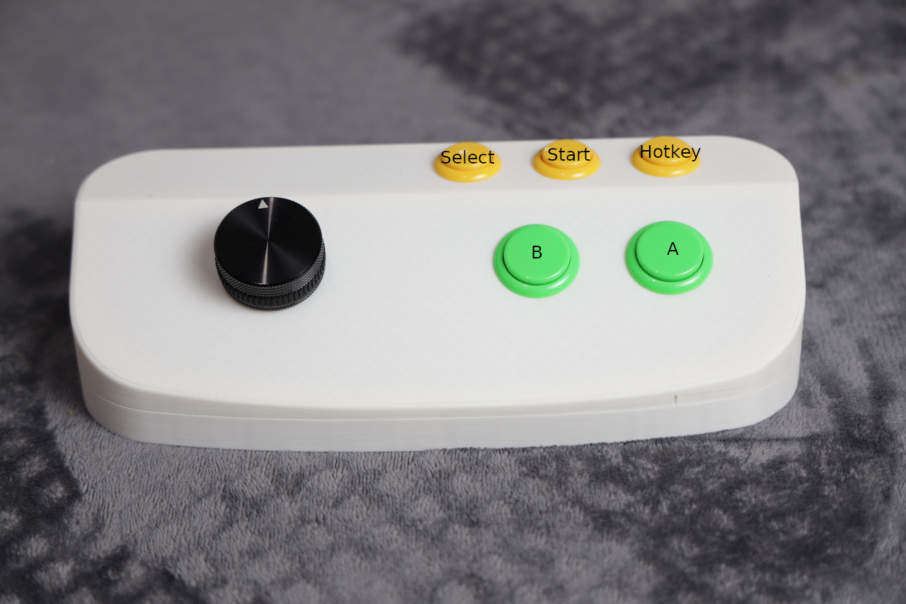
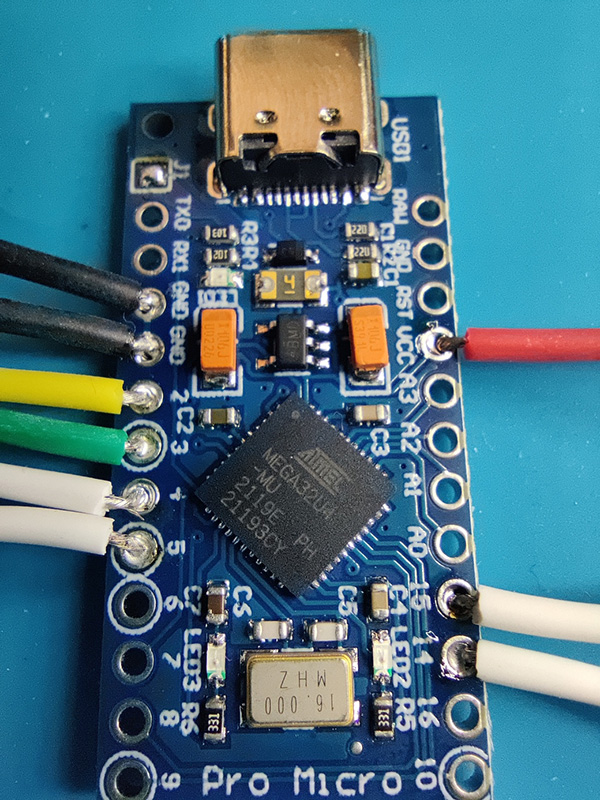
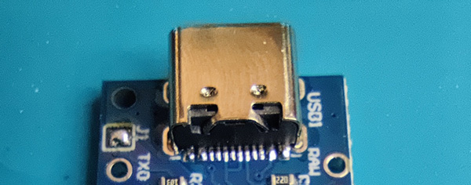

# Arduino Arcade Spinner

Ce projet est une recréation moderne des spinners utilisés dans les bornes d'arcade, principalement pour les casse-briques comme Arkanoid.

L'objectif est d'offrir une sensation proche de l'équipement d'origine en utilisant des composants faciles à obtenir.





## Utilisation

Par défaut, l'appareil fonctionne comme un contrôleur à 5 boutons avec spinner, émulant une souris USB.

**Fonctionnalités :**
- Spinner haute précision (600 PPR par défaut)
- 5 boutons mappés sur les boutons de souris (gauche, droit, milieu, latéral, extra)
- Sensibilité ajustable via le code
- Compatibilité universelle (Windows, Linux, MacOS, RetroPie, MiSTer, etc.)

## Construire le vôtre

### Liste des composants

| Composant | Modèle recommandé | Quantité |
|-----------|-------------------|----------|
| Encodeur rotatif | C38S6G5-600B-G24N (600 PPR) | 1 |
| Microcontrôleur | Arduino | 1 |
| Boutons 24mm | Standard arcade | 3 |
| Boutons 30mm | Standard arcade | 2 |
| Boîtier | Imprimé 3D ou boîte quelconque | 1 |
| Câbles | Dupont ou fils de connexion | - |
| Boitier | [Impression 3D](https://github.com/beudbeud/Arduino_ArcadeSpinner/tree/main/3D%20Files) | - |


**Où acheter :**
- Encodeur rotatif : [AliExpress](https://fr.aliexpress.com/item/1005004359395872.html), Amazon (chercher "600PPR rotary encoder")
- Arduino Pro Micro : [AliExpress](https://fr.aliexpress.com/item/1005006734882677.html), [Amazon](https://www.amazon.fr/d%C3%A9veloppement-Binghe-Microcontr%C3%B4leurs-Interfaces-Compatible/dp/B0D69JLJ97), boutiques électronique
- Boutons arcade : [Boutiques spécialisées arcade](https://www.smallcab.net/boutons-c-30_35.html) ou AliExpress

### Schéma de câblage Arduino



Les boutons doivent être connectés à la masse (GND). Vous pouvez créer une chaîne pour utiliser un GND commun pour tous vos boutons. Utilisez de la soudure ou des connecteurs de fils.

**⚠️ Important :** Faites le pont sur le pad J1 pour envoyer +5V à l'encodeur au lieu de 3.3V



#### Connexions détaillées

**Encodeur rotatif :**
```
Encodeur    →    Arduino Pro Micro
────────────────────────────────────
GND (fil noir)  →    GND
VCC (fil rouge) →    VCC (bridger J1 pour 5V)
A (fil blanc)   →    Pin 2 (GP_2)
B (fil vert)    →    Pin 3 (GP_3)
```


**Boutons :**
```
Fonction          →    Pin Arduino    
─────────────────────────────────────
Button0 (B)      →    Pin 5 (GP_5)   
Button1 (A)      →    Pin 4 (GP_4)   
Button4 (Select) →    Pin 6 (GP_6)   
Button2 (Start)  →    Pin 14 (GP_14) 
Button3 (Hotkey) →    Pin 15 (GP_15) 
```
**Schéma de connexion des boutons :**
```
Relier toutes les masses → GND
```


## Flasher votre Arduino

### Étape 1 : Installer Arduino IDE

1. Télécharger [Arduino IDE 2.x](https://www.arduino.cc/en/software)
2. Installer l'IDE sur votre ordinateur
3. Lancer Arduino IDE

### Étape 2 : Installer la bibliothèque HID-Project

1. Aller dans **Sketch** → **Include Library** → **Manage Libraries**
2. Rechercher "HID-Project"
3. Installer la bibliothèque

### Étape 3 : Configurer la carte

1. Connecter votre **Arduino Pro Micro** à l'ordinateur via USB
2. Dans Arduino IDE :
   - **Outils** → **Type de carte** → Sélectionner **Arduino Leonardo**
   - **Outils** → **Port** → Sélectionner le port COM correct

**Note :** L'Arduino Pro Micro utilise le même bootloader que le Leonardo.

### Étape 4 : Téléverser le code

1. Ouvrir le fichier `Arduino_ArcadeSpinner.ino`
2. Ajuster les paramètres de sensibilité si nécessaire (voir section Configuration)
3. Cliquer sur **Téléverser** (flèche →)
4. Attendre la compilation et le téléversement

## Licence

Ce projet est sous licence GNU General Public License v3.0.

Basé sur les travaux de :
- Adrien Beudin ([beudbeud](https://github.com/beudbeud))
- Benoit BOUNAR (Bounitos) pour le boitier
- Alexey Melnikov ([MiSTer-devel](https://github.com/MiSTer-devel))
- Mikael Norrgård (mick@daemonbite.com)
- [willoucom](https://github.com/willoucom/Arduino_ArcadeSpinner)

## Contributions

Les contributions sont les bienvenues ! N'hésitez pas à :
- Ouvrir des issues pour signaler des bugs
- Proposer des améliorations via pull requests
- Partager vos builds et configurations

## Ressources supplémentaires

- [Documentation HID-Project](https://github.com/NicoHood/HID)
- [Arduino Pro Micro Guide](https://learn.sparkfun.com/tutorials/pro-micro--fio-v3-hookup-guide)
- [MAME Configuration Guide](https://docs.mamedev.org/)
- [Forum Arcade Controls](http://forum.arcadecontrols.com/)
