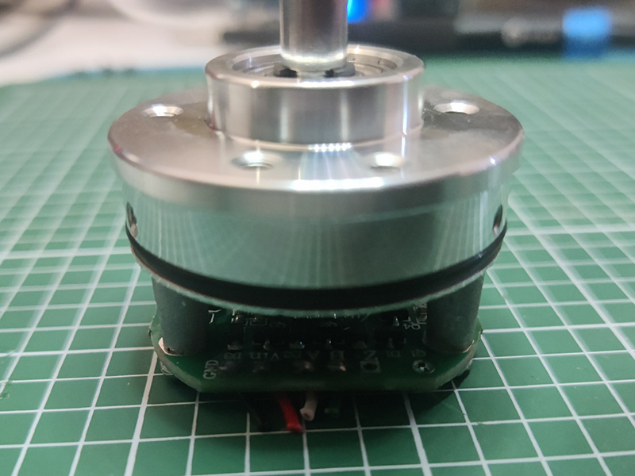

# Arduino_ArcadeSpinner

This project is a modern re-creation of the spinners used in arcades, mainly for brick-breakers like arkanoid for example.

The objective is to offer a feeling close to the original equipment by using components that are easy to obtain.

## Usage

By default the device operate as a 5 button controller with Spinner

## Build yourself

### Parts 

- Rotary encoder (Model: C38S6G5-600B-G24N)
- 40mm Knob with internal diameter of 6mm 
- Arduino Pro Micro
- 3 24mm button
- 2 30mm button
- Enclosure 3D printed or any box

#### Prepare the rotary encoder



1. Remove the metal enclosure and extract the mechanism.
2. Unsolder all wires.
3. Solder fresh wires on GND, VCC, A and B pads.
4. Recycle the original metal case and wire for another project.

### Arduino Pinout


The buttons must be grounded, you can create a daisy chain to use a common GND for your 4 buttons, you can solder the buttons or use wire connectors.

Bridge pad J1 to send +5v to encoder instead of 3.3v

```
Encoder
GND     GND
VCC     VCC
GP_3    A
GP_2    B

Buttons
GP_5    Button0
GP_4    Button1
GP_15   Button2
GP_14   Button3
GP_6    Button4
```
### Flash your Arduino

1. Install Aduino IDE 2.x
2. Open Arduino_ArcadeSpinner.ino
3. Install [HID-Project](https://github.com/NicoHood/HID) library
3. Connect your Arduino pro micro to your computer
4. Select Arduino Leonardo with the correct com port
5. Flash the controller
